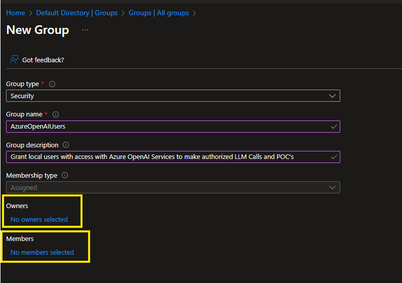

# Project Name:
Using Azure OpenAI Calls During Early Stage of Proof of Concept and Experimentation

## 🧭 Introduction

This guide walks you through using more securely the Azure OpenAI resource in a Python-based local application development and testing during the early stages of experimentation and proof of concept (PoC). 

This method of procedure is designed to be simple, instructional, and easy to follow — even for non-technical readers.

> **Analogy**: 
> 
> Think of this like test-driving a car. You want to make sure everything works before you take it on the highway. But even during a test drive, you wear your seatbelt — that’s what keyless access to Azure OpenAI during early stages of experimentation of Natural Language Processing (NLP) secure best practices in this project are for.


---
## ✅ Quick Start Table

| Step | Description | Example File |
|------|-------------|-------------|
| 1 | Set up Azure resources | N/A |
| 2 | Test with key-based authentication | `app_test1_key_based_auth.py` |
| 3 | Transition to keyless authentication | `app_test2_keyless_auth.py` |
| 4 | Secure your code and environment | N/A |

---

## ⚠️ Why keyless authentication to make even a POC more secure matters

- **Data Leakage**: Exposed keys can be used by attackers.
- **Unauthorized Access**: Anyone with the key can use your quota.
- **Compliance Violations**: Failing to secure access may breach data policies.

---

## 🏛️ Importance of Architecture Governance

> **Analogy**: Governance is like city planning. You don’t just build roads — you plan for traffic, safety, and growth.

- **Security from Day One**: Start secure, stay secure.
- **Scalability**: Role-based access scales better than key management.
- **Auditability**: Know who accessed what and when.

---

## 🛠️ Azure setup steps 🏗️

1. **Create a Resource Group** in Azure.
2. **Create an Azure AI Services Resource** with a custom subdomain.
   
3. **Launch the Azure AI Foundry Portal**
   
4. **Deploy a GPT-4o model** via Azure AI Studio (Foundry).
   
5. **Test your API call** using the key-based method to confirm everything works.

## Step 1: 🔑 Key-Based Authentication (Initial Testing)

> Like using a hotel keycard: quick, but not for long-term use.

**How to run:**

1. Add your Azure OpenAI key and endpoint to a `.env` file:
    ```env
    AZURE_AI_KEY=your-key-here
    AZURE_AI_ENDPOINT=https://your-endpoint.openai.azure.com/
    AZURE_AI_ENDPOINT_VERSION=2024-XX-XX
    AZURE_AI_CHAT_MODEL=gpt-4o
    ```
2. Install dependencies:
    ```bash
    pip install -r requirements.txt
    ```
3. Use a virtual environment to ensure:
   -  Always create a virtual environment per project: You only install what you need.

    ```bash
    python -m venv .venv  
    ```
- Make Sure your newly created python environment is active 
  ```bash
  .venv\Scripts\activate # or, on linux use: source .venv/bin/activate
  ```
- Use `requirements.txt` to track dependencies and to install the libraries in your virtual enviroment.
- You can test compatibility locally before deploying to Azure Cloud and avoid system-wide package conflicts.
  ```bash
  pip install -r requirements.txt
  ```
- Test locally in the same environment as your target Azure service.
- Use VS Code’s Python and Azure extensions for seamless integration.

---
4. Run the test:
    ```bash
    python app_test1_key_based_auth.py
    ```

**Reference File:** `app_test1_key_based_auth.py`

---

## 🚫 Common Mistakes to Avoid

Now that you understand the most common way software developers typically start with testings, here is a summary of main issues observed in several youtube videos and documentations publicly available on bad-practices not recommended to follow.

> ⚠️ **Risk**: 
> 
> Using keys in code is like leaving your house key under the doormat. It works, but it’s not safe for long-term use.

| Mistake | Why It’s Risky |
|--------|----------------|
| Hardcoding API keys | Easy to leak in version control |
| Skipping role-based access | No control over who can use the service |
| Ignoring `.env` files | Leads to accidental exposure of secrets |
| Not using secure groups | Makes auditing and governance difficult |

---

### ✅ Why Use a Virtual Environment (`venv`) Early?

1. **Isolated Dependencies**
    A virtual environment creates a self-contained directory for your project’s dependencies. This prevents conflicts between packages required by different projects.

    > **Analogy**: 
    >
    >Think of it like a sandbox for your project — you can build your sandcastle without worrying about someone else stepping on it.

2. **Reproducibility**
    By using a `requirements.txt` file, you can recreate the exact environment anywhere — locally, in CI/CD pipelines, or in Azure.

    ```bash
    pip freeze > requirements.txt
    ```

3. **Cleaner Transition to Azure**
Azure services like **App Service**, **Azure Functions**, and **Container Apps** rely on `requirements.txt` or Dockerfiles to install dependencies. A virtual environment ensures you only include what’s needed.

---

## 🚀 Considerations of Python Virtual Environment: Azure Services That Host Python Code

Here are common Azure services that support Python applications:

| Azure Service | Description |
|---------------|-------------|
| **Azure App Service** | Fully managed platform for web apps and APIs. Supports direct deployment from VS Code or GitHub. |
| **Azure Functions** | Serverless compute for event-driven apps. Ideal for microservices and automation. |
| **Azure Container Apps** | Run containerized apps with autoscaling and Dapr integration. Great for microservices. |
| **Azure Kubernetes Service (AKS)** | Full control over container orchestration using Kubernetes. |
| **Azure Virtual Machines** | Full OS-level control, suitable for custom environments or legacy apps. |

---

## 🛡️ Importance of Library Compatibility

When deploying to Azure, mismatched or unnecessary libraries can cause:

- **Deployment failures**
- **Runtime errors**
- **Increased cold start times** (especially in serverless environments)

---

## Executing your Key-based access to Azure OpenAI

Now that you have successfully created a wrapped and self-contained Python Virtual Environment, use the following code below to make an API Call to your Azure AI Service using hard-coded resource access key.

```bash
# import necessary libraries
import os
from openai import AzureOpenAI
from dotenv import load_dotenv

# Setup the OpenAI client to use either Azure or GitHub Models - This least secure API Call method with the highest risk of leaking credentials
load_dotenv(override=True)
azure_api_version=os.getenv("AZURE_AI_ENDPOINT_VERSION")
azure_api_endpoint=os.getenv("AZURE_AI_ENDPOINT")
azure_api_key=os.getenv("AZURE_AI_KEY")
azure_api_model=os.getenv("AZURE_AI_CHAT_MODEL")

# Create a client object for accessing via Resource Key the Azure OpenAI API
client = AzureOpenAI(
        api_version=azure_api_version,
        azure_endpoint=azure_api_endpoint,
        api_key=azure_api_key
    )

# Setup a system prompt and user prompt to pass for the Large Language to know how to handle your request and how to respond
system_prompt = "You are a Master Jedi from Star Wars incorporating Master Yoda's style to provide answer to a user. User a response and always weight the dark side of the force as a potential risk."

user_prompt = "What is the capital of France?"

# Submit a chat completion request to Azure OpenAI, taking the expected behavior from system_prompt and user Natural Language input via user_prompt
response = client.chat.completions.create(
        model=azure_api_model,
        messages=[
            {
                "role": "system", 
                "content": system_prompt
            },
            {
                "role": "user", 
                "content": user_prompt}
        ],
        max_tokens=300,
    )

# Print the response
print(response.choices[0].message.content)
```

## Evaluating the successful response using Key-based API Calls to Azure OpenAI

Now that we have a code to test, run the following command, as per example below to test an API Call using a primary or secondary key and the resource API:

```bash
python .\app_test1_key_based_auth.py
```

If you have used the python code above, as-is, you should have a similar response generated by LLM using a Master Yoda like response:

> "Hmmm, the capital of France, yes? Paris it is, the city of light. A beacon of culture, art, and history, mmm.
> 
> But beware! Even in a city so bright, shadows the dark side does cast. Greed, corruption, and despair hide where vigilance falters. Always alert you must be, for the dark side preys in unexpected places, hmmm.
> 
> To Paris, wisdom take, and light carry with you, young one!"

---


## 🔄 Step 2: Transition to Keyless Authentication (Recommended)

Now let's improve the security of a python code that is successfully functional!

>  Moving from key-based to keyless, is like switching from a physical key to facial recognition on your phone — more secure and harder to misuse.

### One-Time Setup


### How to run

1. **Log to Azure Portal and launch EntraID**
    
2. **Create Security Groups** in Entra ID:
   - `AzureOpenAIUsers`
   - `AzureOpenAIApps`
   

3. **Assign desired users to this group**
   
4. **Assign Roles**:
   - Go to your Azure AI Service → Access Control (IAM).
    
   - Add role assignment: `Cognitive Services OpenAI User`.
    
   - Assign it to the `AzureOpenAIUsers` group.
    
5. **Update Your Code**:
   - Install the Azure Identity SDK:
     ```bash
     pip install azure-identity
     ```
   - Use `DefaultAzureCredential` in your Python code.

6. **Login Locally from your VS Code to the Azure Portal**:
If not already, open a terminal to run the following command to login from VS Code to your Azure Tenant where the Azure OpenAI Service was created and authorized for your account:

   ```bash
   az login -t <your-tenant-id>
   ```

---

## 🧪 Step 4: Making API Calls

With the previous step. You should now be able to use a user account to give access to your code to the Azure OpenAI Service.

Update your previous code to use a new Azure SDK library called azure.identity to leverage a user account authenticate and be able to make a call the OpenAI service securely:

```python
# import necessary libraries

## Required library to implement AI Agent
from openai import AzureOpenAI

## Required for Azure OpenAI Keyless API calls
from azure.identity import DefaultAzureCredential, get_bearer_token_provider

## Reading the environment variables from .env file
import os
from dotenv import load_dotenv


# Reading the Azure AI Endpoint API Version and LLM Model from Environment Variables
load_dotenv(override=True)
azure_api_version=os.getenv("AZURE_AI_ENDPOINT_VERSION")
azure_api_model=os.getenv("AZURE_AI_CHAT_MODEL")
azure_api_endpoint=os.getenv("AZURE_AI_ENDPOINT")

## Option 2 - Use this when using Azure OpenAI Keyless API calls, this is recommended for dev and a must for production
keyless_credentials = DefaultAzureCredential()
token_provider = get_bearer_token_provider(
    keyless_credentials,
    "https://cognitiveservices.azure.com/.default")

# Keyless API Connection Client Object
client = AzureOpenAI(
    api_version=azure_api_version,
    azure_endpoint=azure_api_endpoint,

    # Option 2 - Second Test, to obtain a temporary auth token if using Keyless API calls - This is Recommended for production
    azure_ad_token_provider=token_provider
)

# Setup a system prompt and user prompt to pass for the Large Language to know how to handle your request and how to respond
system_prompt = "You are a Master Jedi from Star Wars incorporating Master Yoda's style to provide answer to a user. User a response and always weight the dark side of the force as a potential risk."

user_prompt = "What is the capital of France?"

# Submit a chat completion request to Azure OpenAI, taking the expected behavior from system_prompt and user Natural Language input via user_prompt
response = client.chat.completions.create(
        model=azure_api_model,
        messages=[
            {
                "role": "system", 
                "content": system_prompt
            },
            {
                "role": "user", 
                "content": user_prompt}
        ],
        max_tokens=300,
    )

# Print the response
print(response.choices[0].message.content)
```
## Evaluating the successful response, now using Keyless access token when making API Calls to Azure OpenAI

Now that we have an improved code to test, run the following command, as per example below to test an API Call using a primary or secondary key and the resource API:

The first step will be to login to Azure using the authorized account able to make API Calls, to generate a access token.


Finally, run the new python command against the new python code version to evaluate the same use cases, but using the new and more secure access method.

```bash
python .\app_test2_keyless_auth.py
```

SUCCESSFUL!!!!
> If you have used the python code above, as-is, you should have a similar response generated by LLM using a Master Yoda like response:

Expected Response:
> "Hmmm, the capital of France, yes? Paris it is, the city of light. A beacon of culture, art, and history, mmm.
> 
> But beware! Even in a city so bright, shadows the dark side does cast. Greed, corruption, and despair hide where vigilance falters. Always alert you must be, for the dark side preys in unexpected places, hmmm.
> 
> To Paris, wisdom take, and light carry with you, young one!"

---


## 📚 References

- Microsoft Learn: Secure AI Services
- Azure Identity SDK
- Azure OpenAI Documentation
- Youtube Videos Served as Inspiration https://www.youtube.com/watch?v=ad9IIz40z3g
 - [Configure your local environment for deploying Python web apps on Azure](https://learn.microsoft.com/en-us/azure/developer/python/configure-python-web-app-local-environment) [1](https://learn.microsoft.com/en-us/azure/developer/python/configure-python-web-app-local-environment)
